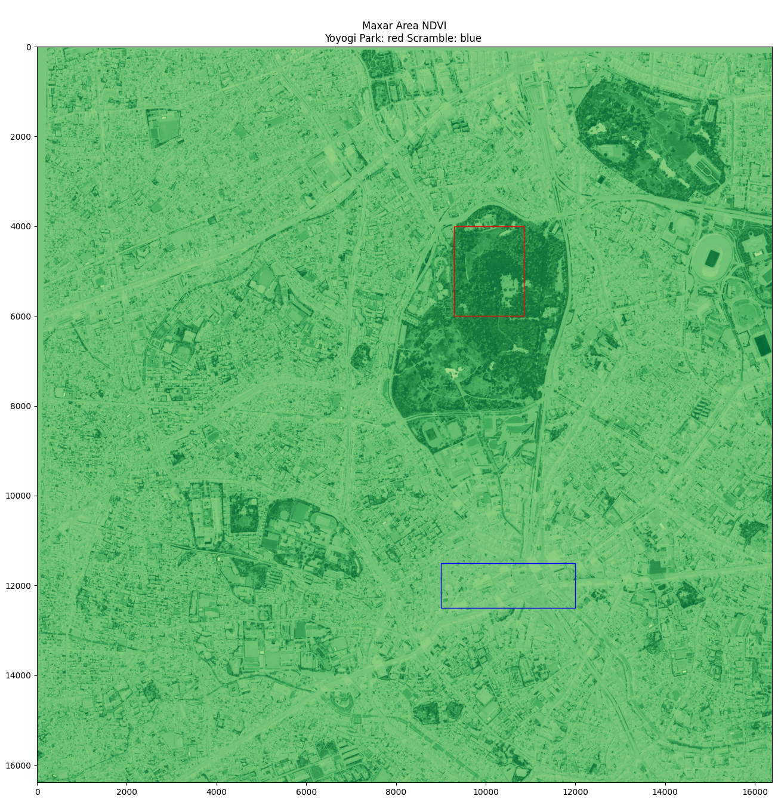

# 記事003 Github

[記事]()のコード管理

## 実装例
- [Sentinel-2  NoteBook](./src/analysis_ndvi_sentinel-2.ipynb)
- [Maxar  NoteBook](./src/analysis_ndvi_maxar_wv.ipynb)

## 環境構築

以下の環境とその手順に従います。
- https://github.com/sorabatake/article_32245_gdal
